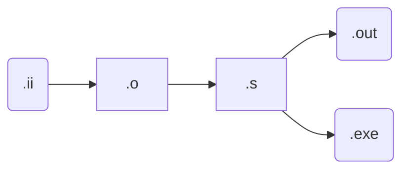
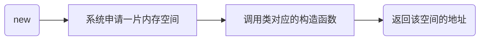

## 基本概念_1——杂项篇


```markdown
一个类应该要有的函数：
	default constructor //默认构造函数
	virtual destructor	//带virtual关键字的析构函数
	copy constructor	//拷贝构造函数
```


#### What to do not How to do

``` markdown
	Class 类，指具有相似特点的东西的抽象集合，类是虚的，是一种观点，像是对象的说明
	Object 实体，对象，是实例化的Class，是实的
	Interface 接口，即对象接收外部消息的途径，方法。主要是为了低耦合，隐藏内部实现
注：Interface也可以理解成一个类对外公开的部分，可以是成员函数，也可以是成员变量
	Encapsulation 封装，把数据和对数据的操作放在对象里，隐藏数据的细节，其他对象只能通过受允许的操作来操作数据
	:: 域名解析符，用法<Class Name>::<function name>   不加Class Name时意味着为全局函数，同理 ::a++，意味着全局变量a++
```

#### 一些基本常识：

```markdown
	{
		code;
	}
可以使用大括号来把一些代码括起来，其中的变量仅在大括号中存在，离开大括号就会自动销毁

	# 开头的代码是编译预处理指令 如：#ifndef xxx 如果没有定义xxx #define xxx就定义xxx  #endif 定义结束
	注：#ifndef 常用于可能会出现反复定义的情况时 如：a.h中include了b.h，b.h中include了a.h，导致a.h中的定义出现不止一次
因此引入了标准头文件结构避免出现重复定义：
	#ifndef HEADER_FLAG
	#define HEADER_FLAG
	//code
	#endif
	一个头文件只放一个Class的声明（Class大概是只有声明）
	"xxx.h"	用""括起来的头文件，编译器会去当前目录查找 
	<xxx.h>	用<>括起来的头文件，编译器会去系统目录查找
	<xxx>	c++特有的插入方法
	*.h	文件中放声明（只有头没有body）declaration  **全局变量的declaration用关键字 extern <var type> <var name>**
该方式等价于对编译器说，我知道有一个全局变量，叫什么，什么类型，但我不知道它在哪里，然后编译器就会给它留个位置
	头文件 Header == interface
	*.cpp 文件中放定义（有头有body，实现）  definition，一个.cpp文件就是一个编译单元，在编译环节，编译器只会关注这一个编译单元，所以就是存在和其他编译单元同名的全局变量也是能通过编译的
	Abstract 抽象，只看某个层次，屏蔽其他部分的做法就叫抽象
```

```markdown
一般来说a.h文件是用来给调用a.cpp文件中的实现的其他文件看的，a.cpp文件是用来实现的。但也有特例，如内联函数的定义就需要直接写在.h文件中
```

### [内联函数](#内联函数)

#### 编译过程：	




#### g++命令

```markdown
	--save-temps  保留中间文件
	-Wall  输出所有可能的warning
	-c 只编译不链接
```


## 基本概念_2——变量篇

#### 常识

```markdown
    local variable 本地变量，函数中定义的变量
    parameters	函数参数
两种variable都是一样的，仅在对应函数运行时存在，放在本地
```

#### **重点**

```markdown
    field （一般）成员变量，类中的变量。存在于对应实例化的对象中，如，a，b都为A类的对象，则a中的成员变量值与b中可以不同
```

[参看检验代码_1 ](#分析类不同实例的成员变量值			==检验代码_1==)

```markdown
注：c++对象中实际仅有成员变量，也就是说，A a，实际a指向的地址中只有a的成员变量，没有成员函数在里面
```

[参考检验代码_2](#探究c++对象实质			==检验代码_2==)

```markdown
	field_function 成员函数，类的函数，属于类，不属于任何某个对象（实例）,相当于是该类所有对象的公共函数，但它（成员函数）会知道自己本次控制的是哪一个对象的成员变量
注：实际就是采用了  this 是一个hidden parameter this的类型就是成员函数所属的类的指针，也就是说，所有的成员变量系统实际上是默认在其前面加上了this->，当然主动加上也是可以的

	对于成员变量和成员函数可以这样理解，动物会运动，运动就是一种动物类的成员函数，如鸟会飞，飞这个动作不是属于某个鸟的，而是鸟这类的。但每一个动物的大小，颜色属于成员变量，如某只鸟的颜色，大小，
```


## 基本概念_3——构造析构篇

#### 构造函数

```markdown
	constructor 构造，构造函数。无返回类型和返回值，且与类同名。在对象实例化时自动调用（无法干预），也在此时传参数给构造函数。其他同成员函数
```

##### 例子 如：

```c++
class Tree(){
	int i;
public:
	Tree(int x);	//类Tree的构造函数，这里的形参名必须和构造函数定义处的形参一致	
    void f();
};
Tree::Tree(int x){		//实现一些初始化的操作，实例化对象时调用
    i = x;
}
int main(){
    Tree t(12);
}


```

### 析构函数

```markdown
	destructor 析构，析构函数。无返回类型，且与类同名，但前面多一个tilde ~符号。在对象要被结束掉时调用，无参数。析构意味着该对象的空间即将被收回，此时调用析构函数。
```

##### 例子 如：

```c++
class Cat(){
	int i;
public:
    Cat(int init);
    ~Cat();
    void func();
}

Cat::Cat(int init){ //构造函数
    i = init;
}
Cat::~Cat(){		//析构函数，一般执行释放系统资源等操作
    cout << "Game Over" << endl;
}
int main(){
 	cout << "before create " << endl;
	{
    	Cat cat(1);
	}   
    cout << "after destructure" << endl;
}
```


## 基础概念_4——对象初始化 && new和delete

#### 常识：

```markdown
	c++中的struct和class基本是一样，都可以称为类，只是struct在没有声明访问属性的地方默认为public，而class默认为private。一般只有当类非常简单时用struct，其他情况都用class
```

```c++
struct X{
    int i;
    float f;
    char c;
};
X x1 = {1, 1.1, 'c'};	//结构体初始化的一种方式
```

#### 默认构造函数

```markdown
	default constructor 	没有参数，有参数就不是默认构造函数
如：
	class Y{
		int a;
		public:
			Y(int a);		//有参数，不是默认构造函数
	};
	
	class B{
		int b;
		public:
			B();		//没有参数，是默认
	};
```

### new与delete

```markdown
	new------------对应-------------delete
	new <class name> 申请对应类的空间并返回指向改空间的地址
	new <class name>[<num>]------------对应-----------delete [] <class name>
```

#### 实现流程




#### 拓展：

```markdown
	c++运行时，会有一个inch table用于记录动态申请空间的变量表，记录申请的大小（单位是byte）和地址（首地址），所以若指向某数组空间的指针++后，调用delete时会报错，因为inch table中只记录了首地址
```

#### 例子

```c++
int * psome = new int [10];		//new 10个int 
delete [] psome;			//new时使用了[]，delete时也要用[]，不带[]只会执行第一个对象的析构函数，[]会提示系统，这里要析构多个对象，且会从最后一个对象开始析构
注1：无论使不使用[]，空间都会收回，收回空间查inch table就可以知道要收回的大小和起始地址了，能运行但会死循环
注2：delete可以delete NULL
```

[参考检验代码_3](#解密new与delete	测试1	不带[]		==检验代码_3==)

[参考检验代码_4](#解密new与delete	测试2	带[]	==检验代码_4==)


## 基础概念_5——访问控制&&初始化列表（成员变量初始化首选，且父类的初始化只能初始化列表，否则父类得有默认构造函数）

```markdown
 基础知识：
 	public 公共的，任何人都可以访问
 	private 私有的，只有这个类的成员函数可以访问这个类的成员变量或成员函数，子类也不能直接访问，这是对类来说的，如果是同一个类的不同对象则它们之间可以相互访问对方的private 成员变量
 	protected 受保护的，只有这个类自己和它的子类可以访问，在其他地方则不能直接使用
 	friends	朋友，声明别的类，别的函数，或者别的类的某个函数是朋友，这样朋友就可以访问该类的private。一般用在运算符重载
注：c++的访问控制只在编译环节存在，运行时其实没有访问控制。运行时对象b也可以访问对象a的私有变量和函数
```

[参考检验代码_5](#解密new与delete				==检验代码_5==)


```c++
初始化：
类中的成员变量可以在构造函数中实现“初始化”，这样写实际是赋值，并非初始化，当成员变量是一个类，系统会去找该类的默认构造函数，当其没有默认构造函数时，报错。
如：
	class A{
	private:
		int i;
		int *p;
	public:
		A(){p=0;i=0;}	//在构造函数中初始化成员变量p和i
		~A();
	};
	
使用初始化列表 格式：	构造函数(形参):<成员变量1>(初始值1), <成员变量2>(初始值2){}		
					name(args)[:init-list]{}
如：
	class A{
	private:
		int i;
		int *p;
	public:
		A():p(0), i(0){} //在构造函数:后使用初始化列表，这样写，p和i的初始化会在构造函数之前完成
		~A();
	};
注：当初始化
```

### friend的使用

```c++
//注2：前项声明，一种用于通知编译器的方式，告诉编译器，有一个叫X的东西存在，因为Y中使用了X，不这样写会报错
struct X;
struct Y{
    void f(X*);		//任何指针的大小都是一样的，且没有用到X内部的成员，因此前项声明可以使用
};

class X{
private:
    int i;
public:
    void initialize();
    friend void g(X*, int);	//函数朋友
    friend void Y::f(X*);	//某个类的某个函数朋友，此处为Y类的f函数是X类朋友
    friend struct Z;		//类/结构体朋友
    friend void h();
};
```

### 特别注意

```markdown
实际上在c++中主要拿到对象的地址就可以为所欲为，哪怕成员变量是private一样想改就改
```

[参考检验代码_14](#C++ conversion				==检验代码_14==)


## 基础概念_6——组合，继承，软件重用

### 类的组合  composition

```markdown
将一些已有的类的对象组合在一起拼凑成一个类，称为组合
如：
	现在有一个class engine的对象和class tyre的对象，把它们组合在一起，拼凑成一个class car
即：
	class中的成员变量可以是其他的class的对象
分类：
	Fully:当一个类就是另一个类的一部分时称为fully	就像肚子里的孩子
	By reference:当一个类知道另一个类在哪里，能调用其方法，但其并非是它的一部分时称为by reference	就像已经生出来的孩子
	
在代码中，fully实际就是成员变量是一个类，而by reference是一个类的指针，指向的。
	一般当一个类是另一个类的一部分时用fully形式，当一个类属于另一个类但不是其一部分时用by reference形式
如：
	人是一个类，书包是一个类，心脏是一个类，则心脏用fully形式，书包用by reference形式
```

#### 例子：

```c++
class Person{...};
class Currency{...};
class SavingAccount{
   	public:
    	SavingsAccount(const char* name, const char* address, int cents); //构造函数，有参数所以不是默认构造函数
    	~SavingAccount();	//析构函数
    	void print();		//一般成员函数
   	private:
    	Person m_saver;		//fully形式的组合
    	Currency m_balance;	//fully形式的组合
};

SavingAccount::SavingAccount(const char* name, const char* address, int cents):m_saver(name, address), m_balance(0,cents){}; 	//SavingAccount的构造函数，需要负责把其fully形式的成员变量初始化，类成员变量也需要，否则系统会去找其类成员变量的默认构造函数
SavingAccount::print(){
    m_saver.print();	//对象自己调用自己的print()
    m_balance.print();
}
```

### 类的继承 inheritance

```markdown
使用一个现有的类来改造，形成一个新的类
如：
	student继承于person则称student是person的超类，因为student继承于person则person有的student都有，但student还有一些person没有的，所以称student是person的superset，即超集

分类：
	Base	基类
	Super	超类
	Parent	父类
	Derived	派生类
	Sub		次类
	Child	子类
使用方法：class B : public A{};		B继承于A
```

[参考检验代码_6](#继承初体验				==检验代码_6==)

### 知识点

```markdown
	父类有的成员，子类继承后都会有，但是父类中private的成员子类不能直接用。相当于父辈给子辈留了一笔钱，但钱由信托保管，子辈不能直接使用。编译通不过。
注：protected属性的成员则子类可以直接访问，相当于父类留了一些让子类访问父类private成员的接口，但这些接口别人不能使用
```

### 子类父类构造和析构的顺序

```markdown
构造
	先调用父类构造函数，然后调用子类构造函数，
注：此时若父类没有默认构造函数，则需要在子类的构造函数中使用初始化列表的方式初始化父类且需要给其传参数，即使用构造函数初始化，而非默认构造函数，不这样的话，若父类无默认初始化构造函数编译时就会报错

析构
	先调用子类的析构函数，再调用父类的析构函数
```

[参考检验代码_7](#继承再体验				==检验代码_7==)

### 名字隐藏（C++独有）

```markdown
	当父类中有overload的成员函数，且和子类中的成员函数同名时，c++会自动隐藏父类中的那些成员函数，只保留的子类自己的成员函数
注1：此时想调用父类的那些函数得用域解析符 ::
注2：当子类和父类有同名且同参数的成员函数时，默认使用的是子类的成员函数，如果想要使用父类的则需要使用 域解析符 ::
如：
	class A{...};
	class B : public A {...};
	B b;
	b.func();	//使用B中的成员函数func
	b.A::func();//使用A中的成员函数func
```

[参考检验代码_8](#c++名字隐藏				==检验代码_8==)


## 基础概念_7——函数重载 &&内联函数

### 函数重载

```markdown
重载——overloading
	指一些函数可以具有相同的函数名，但它们的参数不一样（类型，个数...），调用函数时编译器会根据给出的参数来判断调用的哪一个函数
注：返回类型不能作为构成overloading的条件

缺省值——default arguments（少用）
	可以预先给函数的形参赋上值
	写法：
		int func(int i, int j, int k=1, int m=2){};
注1：没有缺省值的形参要放在有缺省值的形参前面
注2：如果有多个编译单元，即.cpp文件，记得一起编译，否则会找不到定义
```

[参考检验代码_9](#C++重载				==检验代码_9==)

### 特别注意：

```markdown
	缺省值一般是写在.h文件中，即写在函数声明中，当然函数的声明也可以写在.cpp文件中（这样的话，假如别人的函数实际上是没有缺省值的，但你在自己的.cpp文件中给它加上一个带有缺省值的声明也是可以的，且此时仅自己的.cpp文件中声明生效），且如果没有声明，只有定义也可以直接写在定义中
```

[参考检验代码_10](#C++缺省声明探究				==检验代码_10==)

### 内联函数

```markdown
提出原因：
	函数调用涉及一系列的压栈出栈操作，在存在同一个函数大量调用时，影响效率，因此提出了内联函数
使用方法：
	inline <callback type> <function_name> (){}
原理：
	当编译器检测到inline关键词时会将inline函数的代码嵌入到调用它的地方，且仍保持inline函数的独立性（函数有自己的变量，空间...）
与C的#define的不同：
	#define不做类型检查，inline定义的函数会对参数做类型检查
如：
	#define f(a) (a) + (a)		//不会检查传来的参数是什么类型
	inline int f(int a){return a*2;} //会检查传来的参数是否是int类型
注：
	当用户定义的inline太过复杂时，编译器可能会拒绝嵌入
```

### 例子

```c++
inline int func(int i){
    return i*2;
}
int main(){
    int a = 4;
    int b = f(a);
    return 0;
}

//实际上现在f(a)等价于 a + a，编译器会自己优化成这样
```

### 特别注意：

```markdown
内联函数的要求：
	当内联函数需要被其他编译单元调用时，需要将内联函数的函数体（即函数实现，定义）放在.h文件中，因为编译器要在调用的地方嵌入内联函数的代码，而编译器同一时间只能处理一个编译单元，所以必须在预处理时将内联代码放入调用其的编译单元内
注1：只在本编译单元调用inline函数时，不用写到.h文件中（废话）
注2：非常小的函数，编译器自动inline，太大的函数，inline无效，递归函数不要inline。建议只有两三行，且调用次数多的函数使用inline
```

[参考检验代码_11](#C++其他编译单元调用内联函数				==检验代码_11==)

### 类中的内联函数

```markdown
	当在类中直接给出成员函数的body时，编译器默认为inline
```

```c++
class A
{
public:
	void print() { cout << "A::print" << endl; } 	//默认为内联函数
	void test();								//一般成员函数
	void inline_test();			//这也是inline型，只是放在类外面
	void set_i(int ii) { i = ii; }				 // inline型成员函数
private:
	int i;
} void A::test()
{ 											//一般成员函数的body
	cout << "A::test()" << endl;
}
inline void A::inline_test()   //inline型成员函数的body，inline关键字不能省
{
	cout << "inline A::inline_test()" << endl;
}
```

```markdown
注：这样写，从运行的效果来说，如果inline型的成员变量访问该类的成员变量，实际相当于直接访问成员变量，如a.set_i(10)运行效率等价于a.i=10
```


## 基础概念_8——const

```markdown
基础知识：
	被const关键词修饰后，变量不能进行修改和再次赋值，但对于c++来说，const修饰后仍然还是变量，不是常数，仍然遵循一般变量的规则
extern关键词可以声明该变量是一个定义在某处的变量
如：
	extern const int bufsize; //bufsize是某处的一个变量，且在此处是const的
const的使用：
	如果该变量用const修饰，且编译前已经知道了其具体值，此时则可以用于给数组确定大小，若编译前不知道值，则编译时报错，因为编译器不知道给该数组分配多大的空间
如：
	const int n = 12;
	int array[n];		//可以使用
	
	int x;cin>>x;
	const int size = x;
	int array[x];	//报错，编译器不知道应该分配多大空间给array
同理，用extern const int bufsize; 这样也不能用来给数组分配空间，因为编译器不知道bufsize到底有多大
```

### 指针和const

```c++
char* const q = "abc";		//q这个指针是const的，即其指向的地址不能改变
*q = 'c';	//可以
q++;		//不可以，其实就是指针的内容不能变，但指向的地址的内容可以变

const char* p = "ABCD";	//q这个指针指向的内容是const的
*p = 'b';	//不可以，报错，即这个内容是不能改变的	实际是不能通过p指针来修改那个内存单元，而非是那个内存单元不可修改
p++;	//可以，指针的内容是可以变的
```

### ==总结==

```c++
const 在*前时，指针指向的内容是const的，在*后时，指针是const的。
如：
	Person p1("Bob", 200);
	const Person* p = &p1;	//指针指向的对象为const
	Person const* p = &p1;	//指针指向的对象为const
	Person *const p = &p1;	//指针为const
注1：当指向的对象为const时，并非说对象不可修改，而是指不能被这个指针所修改
    //一般用在，如要传一个对象给其他人，但直接传对象太麻烦了，要拷贝...，传指针快还方便，但害怕别人用传过去的指针修改对象，所以可以传const指针，这样就不能通过该指针修改了
    
注2：用指针指向写死的字符串时默认是const	如： char *s = "hello world";这字符串是会放到代码段中，然后s指向其，编译器默认其为const
//但char s[] = "hello world";则可以，因为系统会把代码段中的"hello world"拷贝到堆栈中的s数组中
```

[参考检验代码_12](#C++ const运用				==检验代码_12==)

### 其他

```markdown
在函数后面加上const，一般出现在类中，意味着该函数不能修改该类的成员变量的值
注：此时该函数声明和定义的地方都得加上const
如：
	class A{
	public:
		A();
		~A();
		void test_func() const;		//声明一个带有const关键字的成员函数
	private:
		int i;
	};
	void A::test_func() const{	//带有const关键字的成员函数的定义
		i++;	//报错，const类型的成员函数无法修改成员变量的值
	}
注1：实现原理实际上是编译器把this改成了带const关键字的this，所以该函数通过this无法修改成员变量，因为const <pointer_type>* p，p所指内容无法通过p修改
注2：如果在一个对象前面加上const则该对象就没法被修改了
如：
	const A a;	//a的成员变量无法被修改，这样做没有意义
```

### 使用const来实现重载

```markdown
实际上就是默认参数this带了const关键字，所以可以重载
```

[参考检验代码_13](#C++ const运用_2				==检验代码_13==)

### 特别注意

```markdown
当对象带有const关键字时，要求将其所有成员变量在对象在初始化时都初始化（写在构造函数里面初始化和使用初始化列表初始化都可）。并且，如果要调用某个成员函数则该成员函数必须得有带const关键字的重载
	实际上是因为当一对象带有const关键字时，其调用成员函数时，它传递的this是带有const关键字。因此当其调用某一成员函数，且该成员函数没有带const的重载时，相当于找不到对应函数

当对象有的成员变量是带有const关键字时，则这些成员变量需要在构造函数中初始化，且只能使用初始化列表初始化（只要成员变量带了const关键字，都必须使用初始化列表初始化）
```


## 基础概念_9——引用	reference

### 介绍

```markdown
引用相当于给一个东西又取了一个名字
如：
	char c;
	char& r = c;	//即c和r是同一个字符的两个不同的名字
使用方法：
	一般情况：
		type& refname = name;
		类型& 引用的名字 = 被引用的目标;
	参数表或成员变量时：
		type& refname
注1：引用在定义时必须初始化，且让其初始化的东西必须是在内存空间有地址的
如：
	int& z = i*3;	//报错，因为i*3只有结果，但结果没有储存在内存中
和const搭配
	const int& z = x;	//z是x的引用但不能通过z去修改x的值 即z是read-only reference

注2：&也可以用在函数上
如：
	int& func(); 	//即最后func函数返回的是一个int类型的引用

注3：&不能当作overload的参考，即如果想重载，但两个函数只有&的区别，则报错
如：
	void func(int& a);
	void func(int a);
	int x = 2;
	func(x);	//报错，因为编译器不知道到底要找哪一个func函数

注4：
	实际上，reference的实现就是靠的const point，只是为了少一些*所以提出了reference，且一旦实现了引用就没办法去看这个引用自己的地址了，以后对其的操作都是在对其引用对象操作
```

### 特别注意

```markdown
references和pointres的区别:
	ref不能是null，point可以是
	ref依赖于一个已经存在的变量，point则是独立于其他变量
	ref一旦初始化后，就不能再改变引用对象，point可以改变指向对象
	ref不能引用ref，point可以指向另外的point
重点：
   	有指针的引用，但没有引用的指针，就近原则，*离p近，p就是指针。&离p近，p就是引用
   	即：
   		int&* p;	 //报错，这里的意思是*p的类型是int ref的，即这个指针是int ref类型，出现了引用的指针
   		void func(int*& p);	 //可以，这里指p是ref，它引用的变量是int ref类型的，即指针的引用
  	没有引用类型的数组，因为ref时间根本就不是实体，因此不能有数组
```


## 基础概念_10——转换 conversion，造型 && 多态性  && 覆写 overriding

### 转换&&造型

```markdown
如果B类继承于A类，则主要是A可以使用的地方，B都可以使用。即子类的对象都可以当父类对象看待这叫upcast，向上造型
把父类当子类看待叫downcast，有风险报错
cast 造型和类型转换有区别
```

[参考检验代码_14](#C++ conversion				==检验代码_14==)

### 多态  polymorphism

```markdown
virtual关键字：
	成员函数前带有virtual意味着，如果该类的子类中重新写的该成员函数，则子类的那个成员函数和父类的成员函数有关系，且只要继承树中有一个祖先的函数带了virtual，其子子孙孙的那个同名函数都会默认带上virtual不管用户自己写不写上virtual。一般都写上方便看
多态的实现：
	upcast，向上造型，把子类对象当父类对象看待
	Dynamic binding，动态绑定，运行时才知道到底调用的哪个函数
```

### 例子

```c++
void render(Shape* p){
    p->render();
}
//即这个p->render函数实际调用的是哪个render函数要得到运行时，传的哪个shape或shape类的子类的对象才知道，它会去调用该对象对应的render，这就叫多态，这里p就是多态的
//这里只要是shape或其子类都可以作为参数传进来
//而virtual的意思就是告诉编译器，不要把后面的render函数写死了，实际调用的哪一个render得看运行时是那个对象
```


### ==特别注意==

```markdown
注1：
	任意一个类只要有带有virtual的成员函数则其大小就要比正常的类大且此时编译器会在实例化对象时给对象加上一个隐藏的成员变量vtpr指针，该指针指向这个类的vtable表，所有同一个类的实例化对象都指向同一个表，表中就是该类的各个虚函数的地址。而多态就是把子类的vtable中的虚函数地址换成了子类自己实现的那个虚函数的地址，如果子类没有自己声明那个虚函数则默认填上父类的那个虚函数的地址
```

[参考检验代码_15](#C++ virtual关键字				检验代码_15)

```markdown
注2：
	通过赋值将子类对象赋值即 = 给父类对象，则父类的对象的vtpr仍不变。但可以通过指针来强行改变对象的vtpr指向。如果是通过指向子类对象的指针赋值给指向父类的指针，则实际是指针指向变了，俩对象都没变化
```

[参考检验代码_16](#C++ 魔改vtpr				==检验代码_16==)

```markdown
注3：
	析构函数一般要用virtual格式，因为当把一个子类对象传给一个父类指针时，若delete该指针，当析构函数不是虚函数时，调用的就是父类的析构函数去析构的子类对象（静态绑定编译器直接把对应函数地址写死在那），只有当析构函数是虚函数时，才调用的是子类的析构函数（动态绑定编译器搞出个vtpr，用的时候去找vtable看用哪个函数）
```

### 覆写

```markdown
当子类覆写父类的成员函数后，又想使用父类的成员函数时要用 域解析符 ::
如：
	class A{
		public:
			virtual void f();
	}
	class B : public A{
		public:
			virtual void f(){
				A::f();
			}
	}
```

[参考检验代码_17](#C++ 覆写				==检验代码_17==)

```markdown
注：
	当父类中的某成员函数即有重载（overload）又有覆写（override），则子类必须覆写所有的重载，否则会发送name hidden（函数隐藏）

重载和覆盖（覆写）的区别：
	虚函数是基类希望派生类重新定义的函数，派生类重新定义基类虚函数的做法叫做覆盖；重载就在允许在相同作用域中存在多个同名的函数，这些函数的参数表不同。重载的概念不属于面向对象编程，编译器根据函数不同的形参表对同名函数的名称做修饰，然后这些同名函数就成了不同的函数。重载的确定是在编译时确定，是静态的；虚函数则是在运行时动态确定。
```


## 基础概念_11——引用再体验

```markdown
注1：
	当类中的成员变量是引用类型时，必须使用初始化列表来初始化该成员变量
如：
	class A{
		private:
			int& i;
		public:
			X(int& a);
	}
	X::X(int& a) : i(a) {}		//初始化列表也可以写在类外面
```

### ==特别注意==

```markdown
	当函数要返回一个ref（引用）时，更倾向于返回一个非本地变量（因为离开该函数，本地变量就不存在了），然后就出现了，一个函数的返回值做了赋值符号的左值
如：
	func(3) = 21;
注：
	当函数的形参是ref类型时，向函数传递temporary value（就是那些在内存空间没有储存的地址的值，如23，i*2这种实际上是系统用一个const int型的匿名变量来接值，若非要用一个参数是const int& 的函数来接也是可以实现的😂）
```

[参考检验代码_18](#C++ 引用再体验				==检验代码_18==)

[参考检验代码_19](#C++ 匿名变量				==检验代码_19==)

```markdown
结论：
	在给一些函数传递对象时的方法
A a;			//a是A类的对象
法1：
	func(A x);	//func函数的形参格式
	func(a);	//直接传对象，系统会再拷贝一次对象a，占空间，耗时长
法2：
	func(A* x);
	func(&a);	//传a的地址，不安全，func可以通过x指针修改a中成员变量
法3：
	func(const A* x);	
	func(&a);	//传a的地址，且不能通过x指针修改a中的成员变量
法4：通法
	func(const A& x);
	func(a);	//同上，只是不用在func函数中写很多的*，因为指针要使用时得用*来表示该操作是对指向空间的操作
```

### 细节

```markdown
注意区分函数返回的是值还是变量
如：
	class A{...};
	A func(){	//这个返回的是一个变量，返回值可以作 = 的左值，但是作完左值后，就没办法控制这个变量了，它相当于消失了
		A a;
		return a;
	}
	int func(){		//这个返回的是一个值 10，返回值不可以作 = 的左值
		int i = 10;
		return 10;
	}
```


## 基础概念_12——拷贝构造

### ==特别注意==

```markdown
初始化initialization和赋值assignment的区别
	int i = 10;		//初始化且赋值，初始化只能有一次
	i = 12;			//赋值，赋值可以有多次

注1：c++中既可以使用 = 来初始化对象，又可以使用 () 来初始化，使用 = 时需要存在一个构造函数的参数是 = 的右值
如：
	class A {
		public:
			A();
			A(int i);
	}
	A a; //调用A()构造函数
	A a = 10; //调用A(int i)构造函数
	A a(10); //等价于上一句
注2：
	当初始化时使用另外一个同一个类的对象来初始化一个对象，这就叫拷贝构造
拷贝构造函数，自己不定义时，编译器会自动给出（默认拷贝每一个成员变量，如果有另外的类的对象，则会用对应的那个类的拷贝构造来拷贝这个成员变量，这是成员对成员的拷贝，即有成员变量是类的对象时是通过拷贝构造函数来拷贝的，不是字节对字节的拷贝），格式就是构造函数只是参数是这类的对象的const 引用
如：
	class A {
		public:
			A();	//默认构造函数
			A(const A& );	//拷贝构造函数，& 不能省，不然编译器会告诉你，你写错了🤣，因为不写&就会反复发生拷贝构造还没法跳出循环
			A(int i);	//自定义构造函数
	}
	A a; //调用A()构造函数
	A a = 10; //调用A(int i)构造函数
	A a(10); //等价于上一句 
注3：当类中的成员变量有指针时，拷贝构造函数默认会把拷贝出来的对象的那个指针成员变量指向，被拷贝的对象的那个对应的指针指向的内存空间
```

```markdown
拷贝构造发生在用一个对象去初始化的另一个对象时，有显然情景和隐藏情景
显然情景：
	A a;
	A b = a;		//显然用一个对象去初始化另一个对象
	A b(a);		//等价于上一条语句，只是写的方式不一样
隐藏情景——1：
	func(A b);
	A a;
	func(a);	//在函数调用传递参数时发生拷贝构造
隐藏情景——2：
	A func(...);
	A a = func(...);	//在函数返回时发生拷贝构造
注：
	把拷贝构造函数放在private下面，可以让别人没法用该类的对象来构造另一个对象，不能拿来直接当函数参数传递
```


## 基础概念_13——静态 Static

```markdown
static——c：
	一个全局变量是static的指该变量只在那个.c文件中有效
	一个本地变量是static的指该本地变量具有持久储存（离开这个函数，进入其他函数，该变量依然存在不会被销毁，实际上一个本地变量加上static后就是全局变量）
	一个函数是static的指该函数只能在那个.c文件中被访问
static——c++：
	带static关键字的本地变量，意味着该变量持久储存，但只能在该函数内部访问
	带static关键字的成员变量，意味着该变量可以被该类所有的对象访问，即被所有实例共享，但该变量只会初始化一次
	带static关键字的成员函数，意味着该函数可以被该类所有的对象使用，即被所有的实例共享，但该函数只能访问带有static关键字的成员变量

全局变量的构造函数在程序运行时，main函数执行前执行。它的析构函数在程序结束后main函数结束时调用
注：
	c++多个文件中全局变量的初始化是没有固定顺序的，所以当全局变量之前相互有依赖关系时，要么把有依赖的全局变量全写在用一个文件中，要么别这样写
```

### static 成员变量（实际上就是把那个变量搞成了全局变量，且声明其是某个类的全局变量）

```markdown
注意：
	直接写static int i;这是声明，不是定义，编译能过，但链接过不了，这语句类似于extern int i;即告诉编译器有一个i存在，但在哪并没有说
实际使用需在某处给出static成员变量的定义
如：
	class A{
	public:
		A();
		virtual ~A();
		A(const A& );
	private:
		static int i;	//A类中带有static关键字的i的声明
	}
	int A::i;	//i的定义，没有这句，链接报错，提示找不到i，这句就是正常的定义，除了多了个类名和域解析符，也写成 int A::i = 123;都可以
带static关键字的成员变量，是类的所有对象共享的，且怎能在它定义处初始化，不能用初始化列表来初始化
注：如果成员变量带有static关键字则哪怕没有实例化任何该类的对象，仍然可以通过<class_name>::<var_name>();来使用该成员变量
```

[参考检验代码_20](#C++ 静态成员变量				==检验代码_20==)

### static成员函数

```markdown
如果成员函数带有static关键字则哪怕没有实例化任何该类的对象，仍然可以通过<class_name>::<func_name>();调用该成员函数

注：静态的成员函数只能访问静态的成员变量，连this这个隐藏变量都不能使用（也就是说静态成员函数没有隐藏变量this），因为你甚至可以不实例化对象来调用它，要是它能访问this岂不是找了个寂寞🙌
```


## 基础概念_13——运算符重载

```markdown
c++中能够被重载的运算符：
	+ - * / % ^ & | ~
	= < > += -= *= /= %= ^= &= |=
	<< >> >>= <<= == != <= >= ! && || ++ --
	, ->* -> () []
	operator new	operator delete		//你没看错，new和delete都能重载😮
	operator new[]	operator delete[]
c++中不能重载的运算符：
	.	.*	::	?:
	sizeof	typeid
	static_cast	dynamic_cast const_cast reinterpret_cast
注1：运算符重载只针对已有的运算符，你不能自己搞一个颜文字来重载。运算符重载只是针对自己定义的类或者其他什么自定义数据类型（枚举...）
注2：不能重载基础的数据类型的运算符，什么int的加法重载成减法那是不行的
注3：不能重载操作数个数，即不能把二目运算符改成三目运算符，还不能改运算的优先级
```

### 使用方法

```markdown
运算符重载实际上就是为那个运算符写一个特别的函数，该函数前面要使用operator关键字
该函数可以作为某个类的成员函数
如：
	const String String::operator +(const String& that);
该函数返回一个带const关键字的String类的对象，需要一个String对象参数（+ 需要两个算子，但String是一个类，所以当其对象使用自己所属类的成员函数时，自带一个this，因此只需要一个参数就可以了）
该函数也可以作为全局函数
如：
	const String operator +(const String& r, const String& l);
参数列表中用的带const关键字的引用是为了防止在该函数内部对对象的成员变量进行修改（加法是不会修改两算子的值），因为这不是某个类的成员函数，所有需要两个算子

注：这里返回值也带const的原因是因为防止出现返回结果作左值的情况
如：出现
	a + b = 6;	这种操作，编译通不过
```

### ==特别注意==

```c++
在c++中运算符的左边算子称为receiver，编译器通过左边算子来确定，这个运算符应该用哪个重载的函数
如：
	Integer x(1), y(5), z;	//初始化x, y, z（为赋值）
	x + y;	//实际等价于x.operator+(y)，receiver是x
	z = x + y;	//使用的是Interger的 + ，receiver是x
	z = x + 3;	//使用的是Interger的 + ，receiver是x，且3会被先构造成一个你匿名的Interger的对象（Interger有一个参数为int的构造函数）
	z = 3 + y; 	//用的是int的+，receiver是3，此时需要int有一个通过Integer构造int的构造函数，否则报错，编译不过

一目运算符
class Integer{
...
public:
const Integer operator-() const{	//只需要一个算子的运算符，作为成员函数时不需要参数，因为默认有个this，函数返回值带const是为了防止返回结果作左值，函数带const是为了不修改作运算的对象的值
	return Integer(-i);
}
};
z = -x;	//等价于z.operator=(x.operator-());

注：一目运算符使用全局函数重载时，一般要在操作的类中使用关键字friend声明
如：
	class Integer {
	public:
		friend const Integer operator+(const Integer& lhs, const Integer& rhs);	//声明这个函数是friend，其可以访问Integer类的成员变量（private的成员变量也可以访问）
		...
	};
	
	const Integer operator+(const Integer& lhs, const Integer& rhs){
		return Integer(lhs.i + rhs.i);
	}	//重载 + 的函数的body，返回值加const防止返回结果作左值，形参加const防止修改算子的值
	z = x + y;	//可以，完全符合这个全局重载函数的参数列表
	z = x + 3;	//可以，receiver是x，Integer类有一个自己的运算符重载函数，会先把3构造成一个匿名的Integer对象，在调用全局重载函数
	z = 3 + x;	//可以，会默认把3构造成一个匿名的Integer对象，再调用这个全局重载函数
	z = 3 + 7;	//可以，receiver是3，调用int::operator+()把结果10返回来后用构造函数构造成一个Integer之后在赋值给z
```

```markdown
关于是否把对一个类的运算符重载函数做成成员函数：
1.	单目运算符重载应该做成成员函数
2.	= () [] -> ->* 这几个必须做成成员函数
3.	其他的所有二目运算符做成非成员函数（使用friend关键字在类中声明）

关于运算符重载函数的参数设置：
1.	如果该运算符不会修改算子，则形参要用const修饰，如：+ - =
2.	如果该运算符要修改算子，则形参不能有const修饰，如：++ -- 
3.	如果运算结果不能作左值，则函数需要用const修饰，如：+ -
4.	如果运算结果可以作左值，则函数不要用const修饰，如：[]
5.	如果是类成员函数，且运算结果是会修改该类对象，则该函数不能用const来修饰
```

### 常见的运算符原型

```c++
1.	+-*/%&|~
	const T operatorX(const T& i, const T&r)const;
2.	! && || < <= == >= >
	bool operatorX(const T&i, const T&r)const;
3.	[]
	T& T::operator[](int index);
4.	++
prefix ++（++在算子前）：
    const T& operator++();	//返回的是加完后的结果，如：++a，返回的是a加完后的结果
定义的例子(具体怎么实现得看具体对象)：
const Integer& Integer::operator++(){	//这里函数返回值带ref更方便，要是直接返回一个对象则会发生拷贝构造
    *this += 1;
    return *this;
}

postifx ++（++在算子后）:
	const T operator++(int); //返回的是加完前的结果，如：a++，返回的是a加完前的a
定义的例子：
const Integer Integer::operator++(int){	//这里函数返回值没有带ref是因为不能返回一个本地变量的ref，因为离开了这个函数，本地变量就不存在了
    Integer old(*this);	//拷贝构造
    ++(*this);		//调用上面的prefix ++函数
    return old;		//返回一个对象，在发生一次拷贝构造
}
5.	--
道理同++
	const T& operator--();
	const T& operator--(int);
注：++和--中prefix和postfix参数不一样是为了做重载，编译时，调用postfix函数编译器会自动给一个 0 作为参数
    
6. [] index运算符
    返回的是成员的引用，因为可以用来作左值
```

### 奇淫巧计

```markdown
对于关系运算符：> < >= <= == !=	只需要定义<和==即可，其他的都可以通过这俩来推出
如：
bool Integer::operator==( const Integer& rhs) const {
	return i == rhs.i;			//定义了 ==
}
bool Integer::operator!=( const Integer& rhs) const {
	return !(*this == rhs);		//调用了 == 
}
bool Integer::operator<( const Integer& rhs) const {
	return i < rhs.i;			//定义了 <
}
bool Integer::operator>( const Integer& rhs) const {
	return rhs < *this;	//调用了 <
}
bool Integer::operator<=( const Integer& rhs) const {
	return !(rhs < *this); //调用了 <
}
bool Integer::operator>=( const Integer& rhs) const {
	return !(*this < ths); //调用了 <
}

注：这样写的好处是，以后要修改代码，只需要改两处地方即可
```

### 赋值运算符

```markdown
如果没有给一个类的赋值运算符重载函数，则编译器会自动创造一个赋值运算符的重载
T::operator=(T){}进行一个memberwise的赋值操作，即有成员变量是其他类则要调用那个类的赋值运算符重载函数

注1：如果要自己实现赋值运算符的重载函数，则该函数一定要是成员函数，且是对自己赋值然后返回自己
如：
	T& T::operator=(const T& rhs){
		if(this != &rhs){	//当自己不是赋值给自己时才做赋值操作，否则直接返回自己
			//assignmeng的具体实现
		}
		return *this;
	}
注2：if检查在类有动态申请内存（有指针成员变量）的时候要写，否容易出现问题
如：
	class A{
		private:
			char *p;
		public:
			A& operator=(const& A that){		//此时当出现某对象自己给自己赋值时报错，因为p已经被delete了，that.p不存在，直接报错，要不就读到别人地址了
				delete p;
				p = new [strlen(that.p)+1];
				strcpy(p, that.p);
				return *this;
			}
	}
```

### 类型转换

```markdown
1.	自动类型转换
	当一个函数f的参数需要类A的变量，但类A有一个参数为类B的构造函数，此时给f一个B的对象，仍然不会出错。因为系统会自动调用A的对应的那个构造函数来通过B的对象来构造一个A的临时匿名对象传给f函数，如果不想系统自动转换则需要在该构造函数前加上explicit关键字

2.	默认的自动转换（=> 的意思相当于是可以把 => 左边的东西直接传给右边）：
	Primitive（小范围 => 大范围）：
		char => short => int => float => double
					 => int => long
	Implicit(对于单独某个类来说)：
		T => T&,	绑定
		T& => T,	初始化/赋值
		T* => void*,	去除指针类型，简称退型，指针仍指向那片地址空间，但指针没有类型了
		T => const T,	把一个变量当const看待
		T[] => T*,	数组可以用指针来控制
		T* => T[],	指针可以用数组来控制

3.	专用类型转换（T => C，不同类型之间的转换）
	使用专用类型转换函数
	类中声明：operator target_class();
	类外定义：X::operator target_class(){...}
	作用：将X类的对象转换为target_class类的对象
	专用的类型转换函数，该函数没有写返回类型，实际上target_class就是返回类型，target_class可以是任何系统和自定义的类
如：
	class Rational {
	public:
		...
		operator double() const;	//将rational类转换为double类型
	}
	Rational::operator double() const {
		return numerator_/(double) denominator_;	//实现转换，瞎写的，这里是在举例子怎么写
	}

注：不能出现：
	1. A类中有一个转换为B类的专用类型转换函数a_to_b()
	2. B类中有一个以A类对象为参数的构造函数B(A& a)
	3. 有一个函数f需要一个B类对象，但传给f了一个A类的对象
	此时报错，因为编译器不知道用a_to_b函数还是B(A& a)函数，它俩没有优先级区别，此时要么删掉一个，或者在B(A& a)函数前加上explicit关键字免得系统自动调用这个构造函数
```

[参考检验代码_21](#C++ 自动类型转换				==检验代码_21==)


## 基础概念_14——模板——Template

### 概念

```markdown
	一种重用代码的方式，此时变量类型成为参数，可以有两种Template，function和class两种
```

### 1.函数模板——function template

```c++
//一种模板用来做出函数，相当于告诉编译器，它要怎么帮你做出一个函数
如：
使用一般函数：
	void swap(int& x, int& y){	//这个函数只能交换俩int类型的变量
		int temp = x;
		x = y;
		y = temp;
	}
使用函数模板：
	template < class T >	//template是关键字，class T是用来代表任意类型（你要是喜欢也可以用X）（实际上就是用来占位的，可以有多个如：template <class T1, class T2>，逗号隔开即可），这一语句下面是函数那就是函数模板，是类那就是类模板，即下面的swap函数就是函数模板，T代表任意的类型可以是基本类型也可以是用户自定义类型
	void swap (T& x, T& y){	
		T temp = x;
		x = y;
		y = tmep;
	}
注1：实际上上面的代码是declaration（声明），编译器会把这段代码记录下来，以后遇到调用swap时，会用那个模板把T变成调用处对应的类型X（随便用个字母表示），自动做出一个参数是X类型的swap函数（和其他的swap形成重载）

注2：使用函数模板后系统会ban掉显示（explicit）自动类型转换和隐式（implicit）类型转换，如上面例子中swap(int,int);可以，但swap(int,double);不行

注3：重载规则，检查是否只有唯一的函数匹配--否-->检查是否只有唯一的函数模板匹配--否-->找重载函数

注4：如果函数模板的函数中没有使用到占位的class T，则在调用时需显示的给出标识用哪种类型如：
	template <class T>
	void foo(void ){...}
    foo<int>();	//此时 T 的type是int 
    foo<float>();	//此时 T 的type是float
```

### 2_类模板——class tmeplate

```c++
//一种模板用来做出类，类模板里的每一个函数都是函数模板
例子：
	template <class T>	//同函数模板，关键字和占位类型（占位类型可以有多个如：template< class key, class value> ，逗号隔开即可），表示下面的东西是template，Vector是一个声明
	class Vector {	//和正常类一样，Vector是名字
	public:
		Vector(int);	//构造函数，参数为int
		~Vector();	//析构函数
		Vector(const Vector&);//拷贝构造函数
		Vector& operator=(const Vector&);	//赋值运算符重载
		T& operator[](int);	
	private:
		T* m_elements;
		int m_size;
	}
注5：使用Vector时因为表示传参数，所以得像 注4 那样显示地指明 T 的type，如：Vector<int> i(100);	//通过参数为int类型的构造函数创建一个Vector对象，且 T 的类型是int

注6：类模板中的类的函数，都得写成函数模板的格式（其实也就是在类成员函数的定义前加上 template <class T >，然后按需求把某些变量类型改成 T ，类名后和域解析符前得加上 <T> ）如：
	template <class T>	//不能省
	Vector<T>::Vector(int size) : m_size(size) { //参数为int的构造函数的定义，注意Vector<T>，中<T>不能省
		m_elements = new T[m_size];
	}

	template <class T>	//不能省
	T& Vector<T>::operator[] (int indx)	{ //赋值运算符重载函数的定义，注意Vector<T>，中<T>不能省
		if (indx < m_size && indx > 0){
			return m_elements[indx];
		}else {
			...
		}
	}
注7：如果出现Vector< Vector < double *> >;（即有一个Vector它的每一个单元都是一个Vector，而那个Vector的每一个单元都是一个double *）这种要注意，最后面的两个>，有些编译器要中间加一个空格，否则会识别为右移或者流
    
注8：模板函数的占位类型实际可以非常复杂如：
    Vector< int (*) (Vector<double>&,int) >;（一个Vector它的每一个单元都是一个函数指针，该函数指针指向的函数的参数有两项，第一项是一个每一个单元都是double的Vector而且是通过引用传递，第二项是一个int）
```

### 3_模板函数——template function

```c++
就是由模板生成的函数
```

### 4_模板类——template class

```c++
就是由模板生成的类
```

### ==特别注意_1==

```c++
模板template的参数不仅可以是一种未指定类型（占位类型），也可以是实际类型（甚至可以给其设置缺省值）
如：
	template <class T, int bounds = 100> //bounds是一个带缺省值的变量，且在模板里面可以直接使用
	class FixedVector {
	public:
		FixedVector();
		//...
		T& operator[](int);
	private:
		T elements[bounds];
	}
	
	FixedVector<int, 50> v1; 	//种50个int
	FixedVector<int, 10*5> v2;	//种50个int
	FixedVector<int> v3;		//种100个int
```

### ==特别注意_2==

```markdown
1.	template和template之间不能做继承，
2.	template可以继承于一个non-template的类

3.	non-template类也可以继承template类（实际是先种出一个模板类再把这个模板类继承给那个non-template类）如：
	class SupervisorGroup : public List<Employee*>{...} //List是一个类模板，这里指定了占位类型为Employee *
```


## 基础概念_15——异常——exception

```c++
概念：
	运行到某处时，有问题出现，但当前环境或程序或函数无法处理，以至于无法继续下去的情况就叫exception，但在某处，某个程序或函数可以处理

关键字：
	try {
		code;						//catch中也可以throw异常
	} catch ( error_type ){			// error_type 是 ... 时表示捕获所有类型的异常
		code;						//catch中也可以throw异常
	}

throw error_type;	//向上抛异常并退出当前函数，直到遇到有catch能捕获抛出的异常时停止
```

### 使用

```c++
try block
    try {
        code_1;								//尝试做一些可能会导致异常的代码
    }catch (error_type_1 var_name){			//error_type_1 var_name可以理解成函数的形参表，且var_name变量在对应的code中可以使用，其实catch就像一个处理函数
    	code_2;
    }catch (error_type_2 var_name){			//针对error_type的子类，会执行类型转换（upcast，向上造型），即子类的捕获要放在父类捕获前，否则该子类catch永远无法执行，编译无法通过
        code_3;
    }									//catch查找是按从上到下的顺序查找的，如果catch(...)是第一个catch则其后的catch全部永远没法执行，编译无法通过


特色操作：
    void func(int a) : throw(error_type_1, error_type_2){	//c++函数后面这样写，代表该函数在运行时最多可能会抛出这些异常，这样写后func只能抛出error_type_1和error_type_2两种异常，抛其他异常，系统反而会抛异常
    	code;
	}
	//一个函数后面不这样写，则可以抛出任何异常。如果是throw()，括号里面不写类型则意味着该函数不会抛出任何异常

注：c中malloc失败时会返回一个null，但在c++中不会，只会抛一个bad_malloc异常
```

### ==特别注意==

```markdown
构造函数中如果使用抛异常来通知构造失败的话（因为构造函数和析构函数没有返回值），可能会导致奇奇怪怪的问题，因为如果构造函数使用到了new，但构造没成功，抛了异常，那么new来的空间就变成垃圾内存了
```


## 基础概念_16——流——stream

```markdown
流——单方向
c和c++对文件操作的区别：
	c语言中，对一个文件可以任意的游走（random access），从第一段开始读，从第25段的第34个字符开始读。而c++的流是单方向的，“流”过去了，就没有了

流操作——Stream operations
1.	Extractors —— >> 从流里面读东西（已经被重载，根据左边的receiver不同调用的不同，如果receiver是istream则是extractor，receiver如果是一个int则是右移）

2.	Inserters —— << 向流里面写东西（同上）

3.	Manipulators —— 操控流的怎么读，怎么写（类似格式化输入输出）

流的类型——Stream type
1.	Text streams
	文本流，parse和format，解析和格式化
2.	Binary streams
	二进制数据，
```

### 基本操作

```c++
1.	istream >> lvalue
	会根据lvalue的变量类型，自动解析怎么把值传给lvalue
注1：自动解析的类型：
	char		%c
	short, int	%d
	long		%ld
	float		%g
	double		%lg
	long double	%Lg
	char *		%s
	void *		%p

2.	手动重载 >> 运算符
istream& operator>>(istream& is, T& obj){	//第一个参数（也就是receiver），istream&之所以不加const是因为要修改流
	code;		//读取流操作
	return is;	//返回类型也是istream& 是操作流之后可以把操作完后的流继续操作，如：( ( cin>>a )>>b )>>c
}

3.	手动重载 << 运算符
    ostream& operator<<(ostream& os, const T& obj){
    	code;		//实际插入流操作
    	return os;		//	( ( cout<<a )<<b )<<c，返回的是ostream&的原因
	}
4.	常见使用
    ch = cin.get();	读一个字符，如果读完了则返回EOF
    cout.put(ch);	// 打印一个字符
    ignore(int limit = 1, int delim = EOF);	跳过多少个东西不读，一直读到什么位置，这里缺省值是跳过一个，一直读到结束
    cout.flush();	//强制输出流的内容到物理介质上去
5.	manipulator，格式化	//要导入头文件iomanip
    endl其实是个manipulator
    //例子
    cin >> hex >> n;	//以十六进制输入给n
    cout << setprecision(2) << 1000.243 << endl;	//按两位小数输出
	cout << setw(20) << "OK!";	//占20位，输出右对齐
6.	常见manipulators:
	dec, hex, otc	数字进制转化						   		 			I,O
    endl			插入一个新行，并使用flush				 					 O
	flush			flush流（相当于刷新缓冲区）								O
	setw(int)		设置占位宽度（最小要这么宽，宽度大于设定则不管）			I, O
	setfill(ch)		如果输出的东西没有设定的那么宽，则用什么填充				 I, O
	setbase(int)	相当于进制拓展，可以设定以任意进制输出						   O
	ws					跳过空格											I
	setprecision(int)	设置精度，即多少位小数									O
	setiosflags(long)	设置流里面都是ON，相当于1							I, O
	resetiosflags(long)	设置流里面都是OFF，相当于0							I, O
7.	预定义流
        cin			standard input
        cout		standard output
        cerr		unbuffered error(debugging) output
        clog		buffered error(debugging) output
```

### ==自定义Manipulator 与 IOS flag==

```c++
1.	Manipulator
//这是全局函数
ostream& manip(ostream& out){
    code;
    return out;
}
ostream& tab(ostream& out){
	return out << '\t';		//返回一个ostream的引用，且返回时还有一个 << 的调用，把'\t'插入到流中
}

cout << "Hello" << tab << "World!" << endl;

2. ios :: flag	标志
    ios::skipws							//忽略前导空格
    ios::lef, ios::right				//设置左对齐，右对齐
    ios::internal						//数值的符号位在域宽内左对齐，数值右对齐，中间由填充字符填充
    ios::dec, ios::oct, ios::hex		//设置整数的基数为10，8，16
    ios::showbase						//强制输出整数的基数(八进制数以0打头，十六进制数以0x打头)
    ios::showpoint						//强制显示小数点
    ios::uppercase						//16进制数大写输出
    ios::showpos						//强制显示符号
    ios::scientific, ios::fixed			//设置指数显示，固定浮点显示
    ios::unitbuf						//每次输出后刷新所有的流
    ios::boolalpha 						//以“true”/“false”的形式输出布尔值
    ios::stdio 							//每次输出之后清除stdout, stderr
   	//使用方法
    2.1		使用Manipulator
    	setiosflags(flags);				//flags 就是上面的代码，如ios::skipws
    	resetiosflags(flags);
	2.2		使用stream成员函数
        istream.setf(flags);					//flags 同理，istream是cin或cout这种流对象
        istream.unsetf(flags);
```


## 基础概念_17——STL——Standard Library

```markdown
1.	容器——Containers（注意在使用时所有的容器都是小写，实际上就是类模板）
	Vector		一个可以在后面（一个方向）增长的数组
	Deque		一个可以在前后都可以增长的数组
	List		双向链表
	Sets		集合（没有重复的元素）
	Map			映射，键值对
	Pair		表达两东西之间的关系，这两东西可以是任何东西
2.	基础算法——Basic Algorithms（实际上是一些函数模板）
	sort		排序
	search		查找
	...
3.	迭代器——Iterators
	如：
		vector<int>::iterator p;	//p是vector<int>这个类里面的类叫iterator的对象
		p = x.begin();				//p现在用来代表x中的第一个元素
		cout << *p << endl;			//*是被重载了的，vector<in>说明p是一个int，所以*p是一个int
		p++;						//++也是被重载过的
4.	所有STL的东西都是在 std 那个命名空间中，所以得使用using namespace std;否则用一个就得加 std::
```


## 类_例子

#### 售票机类

```c++
class TicketMachine {
public:
    void showPrompt();	//成员函数
    void getMoney();
    void printTicket();
    void showBalance();
    void printError();
private:
    const int PRICE;	//成员变量
    int balance;
    int total;
};
```


## 检验代码

#### 分析类不同实例的成员变量值			==检验代码_1==

```c++
#include <iostream>
using namespace std;
class A
{
public:
	int i;
	void f();
};
void A::f()
{
	i = 20;
}
int main()
{
	A a;
	A b;
	b.i = 30;
	cout << "b.i_1 = " << b.i << endl;
	a.i = 10;
	cout << "a.i_1 = " << a.i << endl;
	a.f();
	cout << "b.i_2 = " << b.i << endl;
	cout << "a.i_2 = " << a.i << endl;
}
```

### 输出

```c++
b.i_1 = 30
a.i_1 = 10
b.i_2 = 30
a.i_2 = 20
```


#### 探究c++对象实质			==检验代码_2==

```c++
#include <iostream>
using namespace std;
class A
{
public:
	int i;
	void f();
};
void A::f()
{
	i = 20;
	cout << "A::f()--&i = " << &i << endl;
}

int main()
{
	A a;
	cout << "&a = " << &a << endl;
	cout << "&a.i = " << &(a.i) << endl;
	a.f();
}
```

### 输出

```c++
&a = 0x61fe1c
&a.i = 0x61fe1c
A::f()--&i = 0x61fe1c
```


#### 解密new与delete	测试1	不带[]		==检验代码_3==

```c++
#include <iostream>
using namespace std;
class A
{
private:
	int i;
public:
	A(){i = 0;cout << "A::A()" << endl;}
	~A() { cout << "A::~A(), i = " << i << endl; }
	void set(int i) { this->i = i; }
};
int main()
{
	A *p = new A[10];
	for (int i = 0; i < 10; i++)
	{
		p[i].set(i);
	}
	delete p;
	return 0;
}
```

### 输出

```c++
A::A()
A::A()
A::A()
A::A()
A::A()
A::A()
A::A()
A::A()
A::A()
A::A()
A::~A(), i = 0
```


#### 解密new与delete	测试2	带[]	==检验代码_4==

```c++
#include <iostream>
using namespace std;
class A
{
private:
	int i;

public:
	A() {i = 0;cout << "A::A()" << endl;}
	~A() { cout << "A::~A(), i = " << i << endl; }

	void set(int i) { this->i = i; }
};
int main()
{
	A *p = new A[10];
	for (int i = 0; i < 10; i++)
		p[i].set(i);
	delete[] p;
	return 0;
}
```

#### 输出

```c++
A::A()
A::A()
A::A()
A::A()
A::A()
A::A()
A::A()
A::A()
A::A()
A::A()
A::~A(), i = 9
A::~A(), i = 8
A::~A(), i = 7
A::~A(), i = 6
A::~A(), i = 5
A::~A(), i = 4
A::~A(), i = 3
A::~A(), i = 2
A::~A(), i = 1
A::~A(), i = 0
```


#### 解密new与delete				==检验代码_5==

```c++
#include <iostream>
using namespace std;
class A
{
private:
	int i;
public:
	A()
	{i = 0;cout << "A::A()" << endl;}
	~A() { cout << "A::~A(), i = " << i << endl; }
	void g(A *q) { cout << "A::g(), q->i=" << q->i << endl; }
	void set(int i) { this->i = i; }
};
int main()
{
	A a;
	a.set(1);
	A b;
	b.set(1000);
	a.g(&b);
	return 0;
}
```

#### 输出

```c++
A::A()
A::A()
A::g(), q->i=1000
A::~A(), i = 1000
A::~A(), i = 1
```


#### 继承初体验				==检验代码_6==

```c++
#include <iostream>
using namespace std;
class A
{
public:
	A() : i(0) { cout << "A::A()" << endl; }
	~A() { cout << "A::~A()" << endl; }
	void print() { cout << "A::f()" << "i=" << i << endl; }
	void set(int ii) { i = ii; }
private:
	int i;
};
class B : public A{};
int main()
{
	B b;
	b.set(100);
	b.print();
	return 0;
}
```

#### 输出

```c++
A::A()
A::f()i=100
A::~A()
```


#### 继承再体验				==检验代码_7==

```c++
#include <iostream>
using namespace std;
class A
{
public:
	A(int ii) : i(ii) {}
	~A() { cout << "A::~A()" << endl; }
	void print() { cout << "A::print() i = " << i << endl; }
	void set(int ii) { i = ii; }

private:
	int i;
};
class B : public A
{
public:
	B() : A(15) { cout << "B::B() " << endl; }
	~B() { cout << "B::~B()" << endl; }
	void f()
	{
		set(2);
		print();
	}
};

int main()
{
	B b;
	b.set(66);
	b.f();
	return 0;
}
```

#### 输出

```c++
B::B()
A::print() i = 2
B::~B()
A::~A()
```


#### c++名字隐藏				==检验代码_8==

```c++
#include <iostream>
using namespace std;

class A
{
public:
	A() { cout << "A::A()" << endl; }
	~A() { cout << "A::~A()" << endl; }
	void print() { cout << "A::print() i = " << i << endl; } //A类中print有重载
	void print(int ii) { cout << "A::print(int ii) " << ii << endl; }
	void set(int ii) { i = ii; }

private:
	int i;
};
class B : public A
{
public:
	B() { cout << "B::B() " << endl; }
	~B() { cout << "B::~B()" << endl; }
	void f()
	{
		set(2);
		print();
	}
	void print() { cout << "B::print()" << endl; }
};

int main()
{
	B b;
	b.print();			//使用B类自己的print函数
	b.A::print(1234);	//使用A类的那个print函数
	return 0;
}
```

### 输出

```c++
A::A()
B::B()
B::print()
A::print(int ii) 1234
B::~B()
A::~A()
```


### C++重载				==检验代码_9==

```c++
//code.h文件
void func(int i, int j=8);
//code.cpp文件
#include "code.h"
#include <iostream>
using namespace std;
void func(int i, int j){
        cout << "code.cpp::func " << i << ":" << j << endl;
}
//main.cpp文件
#include "code.h"
int main(){
        func(1,29);
        func(5);
        return 0;
}
//编译时用 g++ code.cpp main.cpp -o main.exe
```

### 输出

```c++
code.cpp::func 1:29
code.cpp::func 5:8
```


#### C++缺省声明探究				==检验代码_10==

```c++
//code.cpp文件
#include <iostream>
using namespace std;
void func(int i=111, int j=111);	//定义文件中的声明，此处声明不会生效，或者说会被覆盖
void func(int i, int j){
        cout << "code.cpp::func " << i << ":" << j << endl;
}
//main.cpp文件
void func(int i, int j=123);	//调用func函数的文件中的声明，会失效
int main(){
        func(5);
        return 0;
}
//编译时用 g++ code.cpp main.cpp	会默认生成a.exe (windows下)
```

#### 输出

```c++
code.cpp::func 5:123
```


#### C++其他编译单元调用内联函数				==检验代码_11==

```c++
//main.cpp文件
#include "code.h"
int main(){
        func(5);
        return 0;
}
//code.h文件
#include <iostream>
using namespace std;
inline void func(int i, int j = 19){
        cout << "i = " << i << " j = " << j << endl;
}
//编译时用 g++ main.cpp
```

#### 输出

```c++
i = 5 j = 19
```


#### C++ const运用				==检验代码_12==

```c++
#include <stdio.h>
int main(){
        const char *s1 = "hello world";
        char s2[] = "hello world";
        printf("s1 =   %p\n", s1);
        printf("s2 =   %p\n", s2);
        printf("main = %p\n", main);
        return 0;
}
```

#### 输出

```c++
s1 =   0000000000404000
s2 =   000000000061FE0C
main = 0000000000401550
```


#### C++ const运用_2				==检验代码_13==

```c++
#include <iostream>
using namespace std;

class A
{
private:
    int i;

public:
    A() : i(2) {}
    ~A() {}
    void f() { cout << "f()" << endl; }
    void f() const { cout << "f() const" << endl; } //这两f函数的默认参数this不一样，一个带有const关键字，一个没有，所以可实现重载
};
int main()
{
    const A a;	//a是有const关键字的对象
    a.f();		//调用的是带const关键字的f函数
    return 0;
}
```

#### 输出

```c++
f() const
```


#### C++ conversion				==检验代码_14==

```c++
#include <iostream>
using namespace std;

class A
{
private:
    const int i;

public:
    A() : i(1) {}
    ~A() {}
    void print() { cout << " A.i = " << i << endl; } // A类中的print函数
};
class B : public A
{ // B类继承于A类
private:
    int j;

public:
    B() : j(4) {}
    void print() { cout << " B.j = " << j << endl; } // B类中的print函数
};
int main()
{
    A a;
    B b;
    a.print();
    b.print();          //调用的是B类的成员函数print
    b.A::print();       //调用的是A类的成员函数print
    int *p = (int *)&a; //这里的&是取地址，不是引用，取a对象的地址，并转换为int类型
    cout << "p = " << p;
    *p = 20; //取了地址后，直接通过地址改变private属性的成员变量的值
    a.print();
    p = (int *)&b; //取对象b的地址，该地址如果是int型指针则正好可以控制A类中的i，即子类中的第一个成员变量
    cout << "p = " << p;
    a.print();
    *p = 123; //肆意改动对象b的private成员变量的值
    p++;      // p是int型指针，++后可以控制对象b中的j
    *p = 2333;
    cout << "p = " << p;
    b.A::print(); //输出i
    b.print();    //输出j
    return 0;
}
```

#### 输出

```c++
 A.i = 1
 B.j = 4
 A.i = 1
p = 0x61fe04 A.i = 20
p = 0x61fdfc A.i = 20
p = 0x61fe00 A.i = 123
 B.j = 2333
```


#### C++ virtual关键字				==检验代码_15==

```c++
#include <iostream>
using namespace std;

class A
{
private:
    int i;

public:
    A() : i(123) {}
    virtual void f() { cout << "A::f()" << endl; }
};
int main()
{
    A a, b;
    a.f();
    cout << "sizeof(a) = " << sizeof(a) << endl;//输出对象a的大小
    int *p = (int *)&a;
    int *q = (int *)&b;
    cout << "q,*q = " << *q << endl;	//输出对象a的vtpr指针
    cout << "p,*P = " << *p << endl;	//输出对象b的vtpr指针
    p++;
    cout << "p+1,*P = " << *p << endl;	//不知道输出了什么玩意的值
    p++;
    cout << "p+2,*P = " << *p << endl;	//输出对现象a中的i的值
    return 0;
}
```

#### 输出

```c++
A::f()
sizeof(a) = 16
q,*q = 4212016
p,*P = 4212016
p+1,*P = 0
p+2,*P = 123
```


#### C++ 魔改vtpr				==检验代码_16==

```c++
#include <iostream>
using namespace std;

class A		//父类A
{
public:
    int i;

public:
    A() : i(123) {}
    virtual void f() { cout << "A::f() i = " << i << endl; }
};
class B : public A		//子类B
{
public:
    int j;

public:
    B() : j(888) {}
    virtual void f() { cout << "B::f() i = " << i << " j = " << j << endl; }
};
int main()
{
    A a;
    B b;
    int *p = (int *)&a;
    int *q = (int *)&b;
    A *aa = &a;
    B *bb = &b;
    cout << "object a : " << endl;	//输出父类A的对象a的成员函数f
    aa->f();
    cout << "object b : " << endl;	//输出子类B的对象b的成员函数f
    bb->f();
    cout << "b.vtpr to a.vtpr" << endl;
    cout << "object a : " << endl;
    *p = *q;	//把子类对象b的vtpr指针赋值给了父类对象a的vtpr指针
    aa->f();	//此时父类对象a的vtpr已经指向了子类的vtable了所以调用的是子类的虚函数
    return 0;
}
```

#### 输出

```c++
object a :
A::f() i = 123
object b :
B::f() i = 123 j = 888
b.vtpr to a.vtpr
object a :
B::f() i = 123 j = 0
```


#### C++ 覆写				==检验代码_17==

```
#include <iostream>
using namespace std;

class A
{
public:
    int i;

public:
    A() : i(123) {}
    virtual void f() { cout << "A::f() i = " << i << endl; }
};
class B : public A
{
public:
    int j;

public:
    B() : j(888) {}
    virtual void f() { A::f(); }
};
int main()
{
    B b;
    b.f();
    return 0;
}
```

#### 输出

```
A::f() i = 123
```


#### C++ 引用再体验				==检验代码_18==

```c++
#include <iostream>
using namespace std;
int array[100];
int& func(int x){
        return array[x];
}
int main(){
        cout << "arry[3] = " << array[3] << endl;
        func(3) = 24;
        cout << "arry[3] = " << array[3] << endl;
        return 0;
}
```

#### 输出

```c++
arry[3] = 0
arry[3] = 24
```


#### C++ 匿名变量				==检验代码_19==

```c++
#include <iostream>
using namespace std;
void f(const int &i)
{
    cout << i << endl;
}
int main()
{
    int i = 3;
    f(i * 3);		//系统会自动创建一个匿名变量来保存这个运算的值
    f(3);
    return 0;
}
```

#### 输出

```c++
9
3
```


#### C++ 静态成员变量				==检验代码_20==

```c++
#include <iostream>
using namespace std;

class A
{
private:
    static int i;

public:
    A() {i = 10;}	//这句只是赋值，不是初始化
    void f() { cout << "A::f() i = " << i << endl; }
    void set(int ii) { i = ii; }
};

int A::i;	// A类中的静态成员i的定义也是初始化（只是没有赋初值）
int main()
{
    A a, b;
    a.set(123);
    b.f();		//如果i是public的，还可以直接b.i或者A::i来访问i都一样
    return 0;
}
```

#### 输出

```c++
A::f() i = 123
```


#### C++ 自动类型转换				==检验代码_21==

```c++
#include <iostream>
using namespace std;

class B;	//B类的前项声明，免得因为B类写在A类后面导致编译器找不到B类

class A
{
public:	//在这个构造函数前加上关键字explicit后，将使该函数不能用于自动类型转换，然后报错
    A(const B &b) { cout << "A::A(const b &b)" << endl; } // A类有一个可以通过B类对象构造自身对象的构造函数
};
class B
{
public:
    B() {}
};
void f(A a) // f函数需要一个A类的对象
{
    cout << "f()" << endl;
}

int main()
{
    B b;
    f(b); //给f函数传一个B类的对象b
    return 0;
}
```

#### 输出

```c++
A::A(const b &b)	//默认调用的了A那个构造函数先通过B类的对象构造处一个匿名的A类的对象再传给f函数
f()
```


