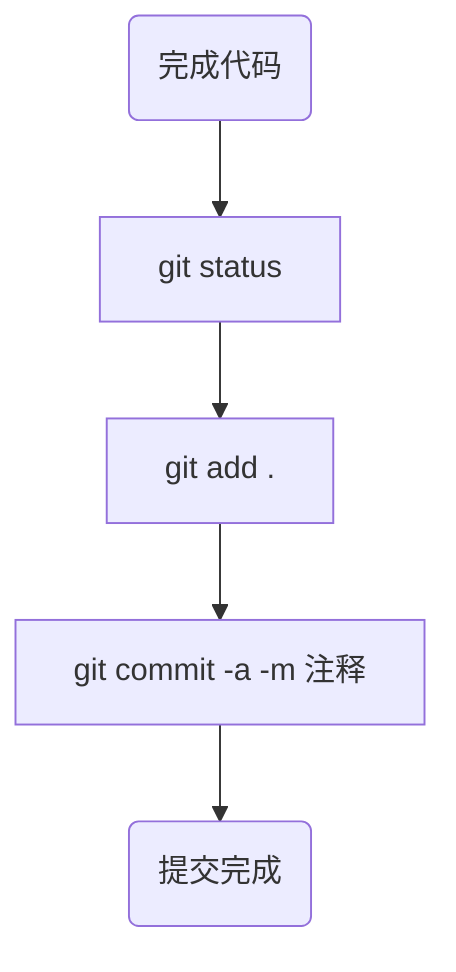

## 创建repository

### 本地

```markdown
在文件夹中使用 git init .使当前文件夹变成 repository 即创建仓库
git status	查看当前git状态
echo "文件名" >> .gitignore	将文件添加到.gitignore中使git不再追踪该文件变化
git rm -r --cached 文件名	删除文件
git add 文件名	添加文件到git跟踪中
git commit -a -m "注释"	完成一次本地提交
git log	查看之前的提交
git reset --hard 之前的提交id	回到之前提交的状态，还原所有没提交的改动，且无法撤销
```

#### 提交流程图




### 同步到云端

```markdown
git push origin	将本地提交同步到云端
git pull	从云端拉取提交
```

### 使用分支

```markdown
git branch	显示所有分支
git branch 分支名称		创建一个分支
git checkout 分支名称	切换分支
git merge a	合并分支 即将分支a合并到当前分支
git branch -D	删除分支
```

