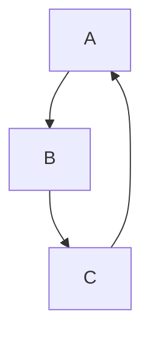
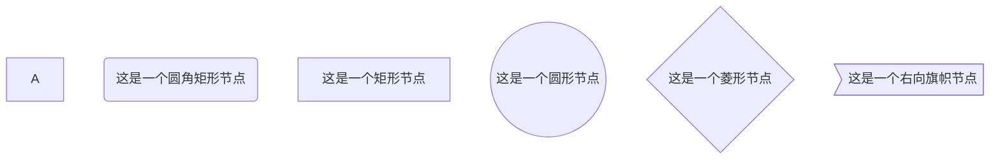
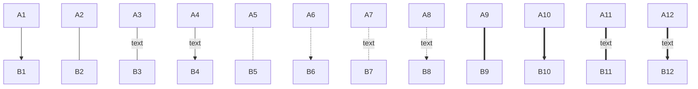
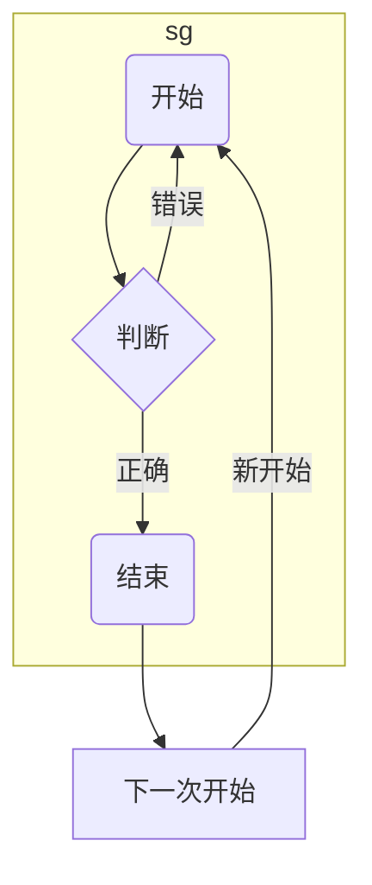
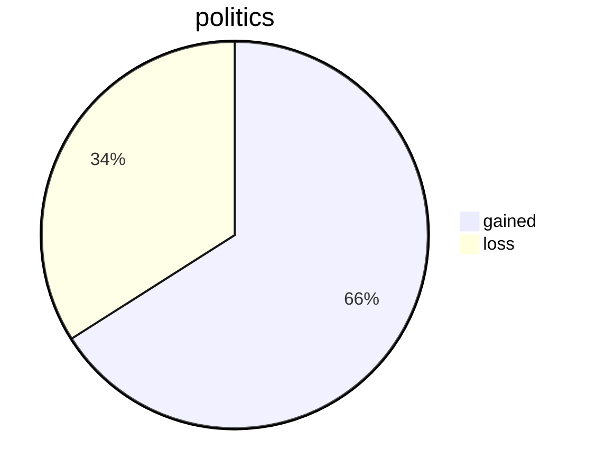
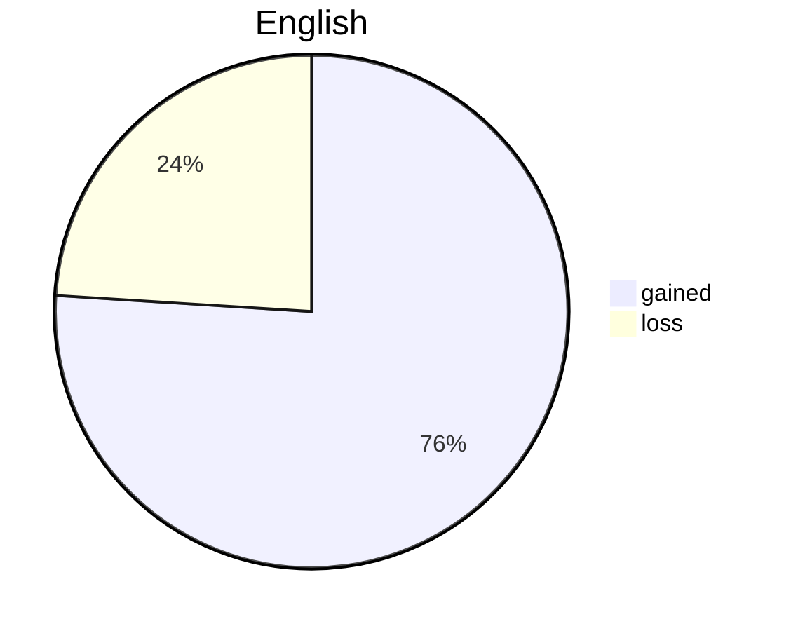
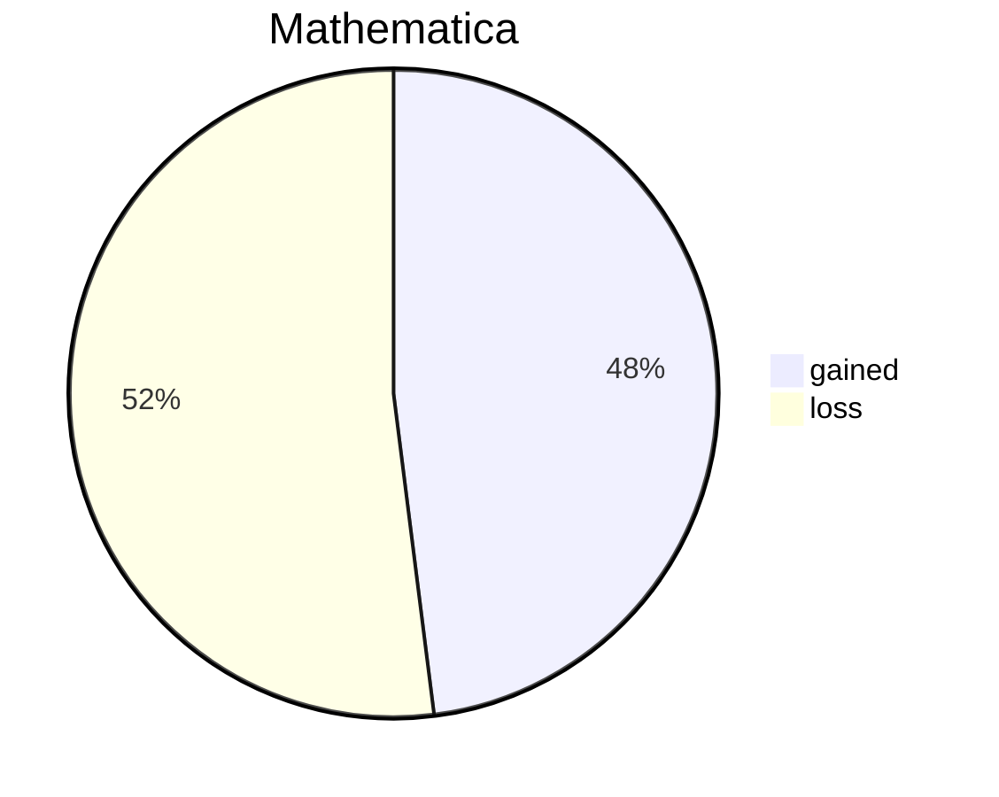
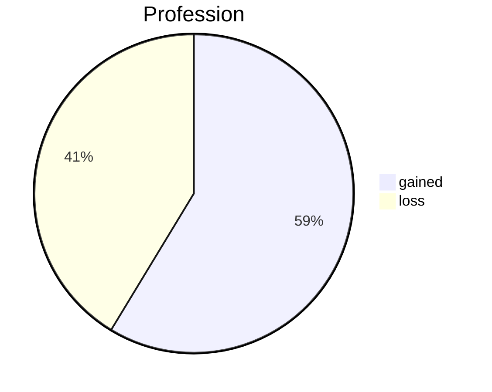
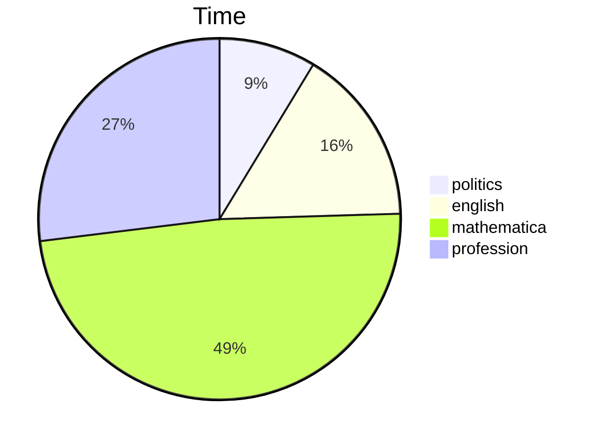
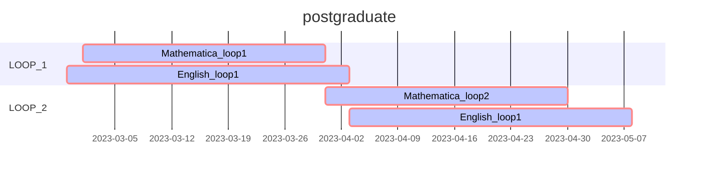

## ==基础部分==

### 关于标题

```一级标题使用一个 `# ` ```

```二级标题使用两个 `#` 以此类推最多支持六级标题```

### 关于文字

``` 删除线 使用 ~~ ~~ 如	``` 	~~这是删除线~~

```斜体 使用 * * 如	```	*这是斜体*

```加粗 使用 ** ** 如	 ```	**这是加粗**

``` 斜体+加粗 使用 *** *** 如``` 	***这是斜体+加粗*** 

```下划线是HTML语法 按ctrl + u``` 如 <u>这是下划线</u>

```高亮（需要勾选扩展语法）使用 == ==``` 如 ==这是高亮==

```下标（需要勾选扩展语法） 使用 ~ ~ ``` 如 这是~下标~

```上标（需要勾选扩展语法）使用^``` 如 这是^上标^

```表情 使用: 后输入单词匹配对应的表情``` 如 这是100分 :100:

### 表格

```表格使用 |来分割单元格 使用-来分割表头和其他行 使用:来控制左右中对齐 ``` 如 

| name  | age  |
| -----: | :----: |
| Alice | 18   |
| Bob | 19 |

### 引用

```使用 > 类似标题也可以使用>>二级引用 以此类推```  如 

> 这是一条一级引用

> > 这是一条二级引用

### 列表

#### 无序列表

``` 使用 * 作为标记或者 + 或者 - 都可```如

* 这是无序列表的第一项

+ 这是无序列表的第二项

#### 有序列表

``` 使用 数字+. 的形式 ``` 如 

1. 这是有序列表的第一项
2. 这是有序列表的第二项

### 代码

#### 代码块

```使用 ``` ``` + 语言名称 如

``` python
print("Hello Python!")
```

#### 行内代码

```使用 ` ` ``` 如 `这是行内代码`

### 分割线

``` 使用 *** 或者 --- 或者 ___ ``` 如 以下是分割线

***

### 跳转

#### 外部跳转 -- 超链接

```使用格式为 [提示文字](链接) 按住ctrl + 鼠标左键点击 即可跳转``` 如 [这是百度](https://www.baidu.com)

#### 内部跳转 --  本文件内跳转到指定部分

```使用格式 [提示文字](# 本文中的某个标题) 按住ctrl + 鼠标左键点击 即可跳转 ``` 如 [关于文字](# 关于文字)

#### 自动链接

``` 使用 < > 中间可填 URL 或者邮箱地址将会自动转换为超链接 ``` 如 

<https://www.baidu.com>

<12344@qq.com>

### 图片

```使用格式  注地址不能加 ""``` 如 这是一张网络图片 

​																								这是一张本地图片 

***


## ==进阶部分==（画图需勾选扩展语法功能）

### 流程图

#### 使用方法

``` graph 方向描述 ```

​		``` 其他语句```

关键字`graph`表示流程图的开始，同时需要指定该图的方向

方向描述为：T为top，B为bottom，R为right，L为left，D为down

| 用词 | 含义     |
| ---- | -------- |
| TB   | 从上到下 |
| BT   | 从下到上 |
| RL   | 从右到左 |
| LR   | 从左到右 |

如



如


#### 流程图常用符号及含义

##### 节点形状

| 表述           | 说明         | 含义                                               |
| -------------- | ------------ | -------------------------------------------------- |
| id[文字内容]   | 矩形节点     | 表示过程，也即是整个流程中的一个环节               |
| id(文字内容)   | 圆角矩形节点 | 表示开始和结束                                     |
| id((文字内容)) | 圆形节点     | 表示连接。为避免流程过长或有交叉，可流程切开，成对 |
| id{文字内容}   | 菱形节点     | 表示判断，决策                                     |
| id>文字内容]   | 右向旗帜节点 | 暂不名确                                           |
| id             | 矩形节点     | 默认id即为节点中的文字内容                         |

```markdown
graph TB;	分号可加可不加，graph表示是流程图
	A	这是一个名称，A默认为矩形节点的内容
	B(这是一个圆角矩形节点)
	C[这是一个矩形节点]
	D((这是一个圆形节点))
	E{这是一个菱形节点}
	F>这是一个右向旗帜节点]
注：定义后可直接使用id来控制节点
```



##### 连线

````markdown
graph TB;
	A1-->B1
	A2---B2
	A3--text---B3
	A4--text-->B4
	A5-.-B5
	A6-.->B6
	A7-.text.-B7
	A8-.text.->B8
	A9===B9
	A10==>B10
	A11==text===B11
	A12==text==>B12
````



##### 子图表

```markdown
subgraph 子图表名称
	其他语句，与graph一致
end 子图表结束，将此段代码放入graph中即可生成子图表
```



### 序列图

#### 概述

```markdown
太麻烦了，放弃
```

### 饼图（pie）

#### 使用方法

```markdown
pie	代表是饼图
	title 饼图的标题名
	该部分名称 : 占比 (输入数量会自动求和后显示占比)
	  ...
```











### 甘特图

#### 使用方法

```markdown
gantt	代表是甘特图
	title 甘特图的标题
	dateFormat YYYY-MM-DD	日期格式 YYYY-MM-DD表示 年-月-日
	
	section A section 部分名，这里名称为A section
	这里写任务名: 参数一，参数二，参数三，参数四，参数五
如：
	Completed task	:done, des1, 2023-03-01, 2023-12-25
	任务名			  :已完成 ，小名为des1，开始时间2023-03-01，结束时间2023-12-25	(参数一未填)
	
注：
	参数一：crit （红色框） 可不填
	参数二：done （已完成），active（正在进行），可不填
	参数三：取小名 可不填 用于实现在某活动之后开始，如：在其他的任务的参数四中使用 after A 则该任务会在A任务结束后开始
	参数四：任务开始时间 必填
	参数五：任务结束时间 必填 可使用 数字+d 表示任务持续多少天 如：3d表示任务持续3天
	当参数只有一个时，表示使用前一个任务的结束时间作为该任务的开始时间，仅留的一个参数为持续时间如 15d 15天
	
```




#### 更多教程查看	[typora官方教程](https://support.typora.io/Draw-Diagrams-With-Markdown/)	[mermaid官方教程](https://mermaid-js.github.io/mermaid/#/)


